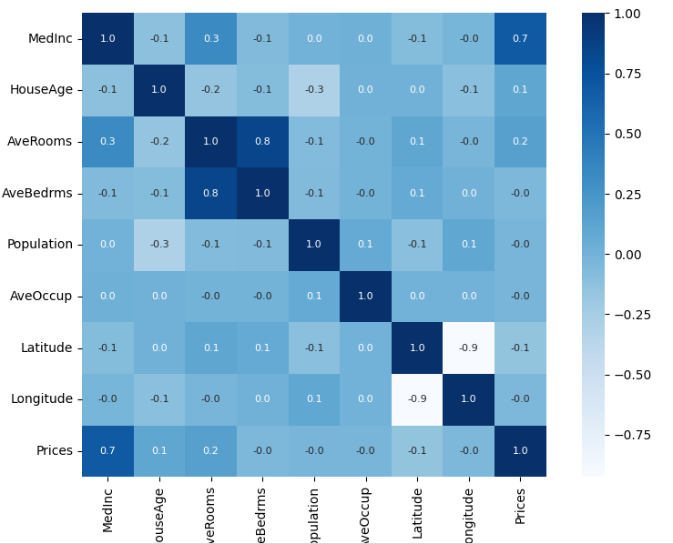

# California House Price Prediction

## Overview

This project uses **Machine Learning (XGBoost Regressor)** to predict house prices in California based on various features such as:

- Median Income
- House Age
- Average Rooms
- Population
- Latitude & Longitude

It is trained using the **California Housing dataset** from `sklearn.datasets`.

---

## Features

- Data loading and preprocessing
- Exploratory Data Analysis (EDA) using `pandas`, `seaborn`, and `matplotlib`
- Model training using **XGBoost**
- Model evaluation with **R² Score** and **Mean Absolute Error (MAE)**
- Visualization of predicted vs actual prices
- Saving the trained model using `joblib`

---

## Technologies Used

- Python 3
- NumPy
- Pandas
- Seaborn
- Matplotlib
- Scikit-learn
- XGBoost
- Joblib

---

## Model Performance

| Metric   | Training Data | Test Data |
| :------- | :-----------: | :-------: |
| R² Score |    ≈ 0.93     |  ≈ 0.84   |
| MAE      |    ≈ 0.19     |  ≈ 0.29   |

The model generalizes well with no major overfitting detected.

---

## Visualization

A scatter plot is displayed to compare **actual vs predicted** prices.

### Correlation Heatmap

Before training the model, a **correlation heatmap** is used to analyze the relationships between different numerical features in the dataset.  
This helps to identify which features are most strongly correlated with the target variable (**Prices**) and which may be redundant.

For example:

- `MedInc` (Median Income) has a **strong positive correlation** with house prices.



```python
plt.scatter(Y_test, test_data_prediction, color='blue', alpha=0.5)
plt.xlabel("Actual Prices")
plt.ylabel("Predicted Prices")
plt.title("Actual Prices vs Predicted Prices")
plt.show()
```

---

# How to Run

1- Clone the repository
git clone https://github.com/YOUR-USERNAME/house-price-prediction.git
cd house-price-prediction

2- Install dependencies
pip install numpy pandas matplotlib seaborn scikit-learn xgboost joblib

3- Run the script
python3 house_price_xgboost.py

4- Output

- R² Score and MAE for both training and test data
- Correlation heatmap
- Scatter plot of actual vs predicted prices
- A saved model file house_price_model.pkl


## Saved Model

house_price_model.pkl

## You can later load it using:

import joblib
model = joblib.load('house_price_model.pkl')
