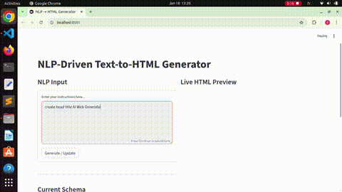

# Text-to-Web Generator (NLP-based) 🚀

## 🚀 Project Overview

This project is an **NLP-powered system** that converts **natural language descriptions** into **structured HTML web pages**.

Instead of manually writing HTML/CSS, users can describe a web page using plain text (e.g. _"create a page with a title centered in red"_) and the system automatically generates a valid and styled web page.

The project focuses on **understanding user intent**, **extracting semantic elements**, and **building a structured representation** that can be rendered as HTML.

---

## 🎯 Goal of the Project

The main objective is to demonstrate how **Natural Language Processing** can be used to:

- Interpret human language instructions
- Extract meaningful entities (elements, sections, styles)
- Generate structured, machine-readable output
- Bridge the gap between **human language** and **web technologies**

This project is designed as a **proof of concept** for intelligent UI generation and AI-assisted web development.

---

## 🧠 Core Concepts

- **Intent Detection**  
  Understand what the user wants to do (create, update, style, etc.)

- **Entity Extraction**  
  Identify page sections (head, body, footer), elements (title, paragraph, navbar), and styles

- **Schema-Based Design**  
  All extracted information is stored in a structured schema separating:
  - Content
  - Structure
  - Styles

- **Incremental Updates**  
  The system supports progressive commands (e.g. first add a title, then style it later)

---

## 🏗️ Project Architecture

The project is built with a **modular and extensible architecture**:

- NLP Layer  
  Responsible for intent detection, entity recognition, and style extraction

- Parser Layer  
  Converts NLP output into a structured schema

- Generator Layer  
  Transforms the schema into HTML with inline CSS

This separation makes the system easy to:

- Extend with new HTML elements
- Add more CSS styles
- Improve NLP models
- Integrate with APIs or front-end frameworks in the future

---

## 🧩 Example Workflow

1. User writes a natural language command
2. NLP module analyzes the text
3. A structured schema is updated
4. HTML is generated automatically

The user can continue refining the page using additional commands.

---

## 🧩 Example command:

```
create head title AI Web Generator
add body title Welcome to my website
add navbar home about services contact
add paragraph This website is generated using NLP
add footer Contact: email@example.com
```

---

## 🔮 Future Improvements

- Support for more complex layouts
- External CSS generation
- Advanced NLP models (transformer-based)
- Front-end interface
- API-based usage
- Multi-language support

---

## 🎥 Demo

A video demonstration explaining how to use the system:



Full video: [Watch the demo](demo/demo_video.mp4)

---

## 👨‍💻 Author

**Salah Essioui**  
Machine Learning Engineer (NLP-focused)  
Open to Machine Learning / NLP Engineer opportunities
[LinkedIn](https://www.linkedin.com/in/salah-essioui) | [GitHub](https://github.com/essioui)

---

## 📄 License

This project is for educational and experimental purposes.
